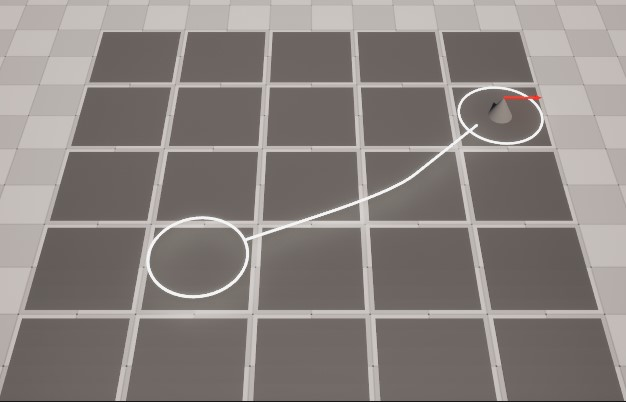

# NavGrid

An Unreal Engine 5 plugin for turn based navigation on a grid.

NavGrid supports grids with arbitrary layout including ladders and multiple levels of tiles. This makes it possible to have tile based movement in complex levels, like for instance multi-floor buildings.

This is a simple fork of [larsjsol](https://github.com/larsjsol/)'s [NavGrid Plugin](https://github.com/larsjsol/NavGrid) cleaned to be UE5-compatible as I will use it for my test projects.

## Compiling

1. Save/clone into the `Plugins/` directory at the project root
2. Compile. You will need to right click on the `.uproject` in your project and select `Generate Visual Studio project files` so VS is aware of the new source files.
3. Add `NavGrid` and `AIModule` to `PublicDependencyModuleNames` in your `.Build.cs`

## Project Integration

A few more steps are needed after compiling the plugin:

1. Enable the plugin for your project in the plugin-browser (`Edit->Plugins`)
2. Create a Collision Channel in the project setting and set its default response to `Ignore` 
3. Place some `ANavTileActor`s and a few `AExampleGridPawn`s in your level
4. Set the PlayerController class to `ANavGridPC`
5. Hit Play!

## Class Overview

Examining the headers for `AGridPawn`, `ANavGridPC` and `UGridMovementComponent` are probably good starting points for figuring out how this plugin works. You probably want to extend `AGridPawn` and create you own player controller for your project.

A few of the classes are summarized below.

### ANavGrid

Represents the grid. It is responsible for pathfinding.

Useful functions:

* `TilesInRange`: Get tiles within the specified distance. Optionally do collision testing and exclude tiles with obstructions.
* `GetTile`: Get a tile from world-space coordinates.

Useful events:

* `OnTileClicked`
* `OnTileCursorOver`
* `OnTileEndCursorOver`

Useful properties:

* `ECC_NavGridWalkable`: The channel used when tracing for tiles. Set this to the channel you created in step 2 of the quick start.
* `EnableVirtualTiles`: Enables placement of virtual tiles on empty spaces. Useful if you don't want to manually place tiles on every walkable part of your levels.

### UNavTileComponent

A single tile that can be traversed by a `AGridPawn`. It will automatically detect any neighbouring tiles.

Useful functions:

* `GetNeighbours`: Get all neighbouring tiles.
* `Obstructed`: Given a capsule and a starting position, is there anything obstructing the movement into this tile?
* `GetUnobstructedNeighbours`: Get all neighbouring tiles that a pawn can move into from this tile.
* `Traversable`: Given a movement mode and a max walk angle, is it legal to enter this tile?
* `LegalPositionAtEndOfTurn`:  Given a movement mode and a max walk angle, is it legal to end a turn on this tile?

Useful properties:

* `Cost`: The amount of movement expended when moving into this tile.
* `Mesh`: Static mesh used for rendering this tile.
* `SelectCursor` and `HoverCursor`: Mesh that can be shown just above the tile as part of the UI.
* Various `*Highlight`: Mesh that can be shown just above the tile in order to highlight it in some way.

### UNavLadderComponent

A subclass of `UNavTileComponent` that can be used to represent a ladder.

### ANavTileActor and ANavLadderActor

Actor containing a single `UNavTileComponent` or `UNavLadderComponent` that can be placed directly into the world.

### AGridPawn

Base class for pawns that move on a NavGrid.

Useful functions:

* `OnTurnStart` and `OnTurnEnd`: Called when this pawn's turn begins or ends. Override to add your own code.

Useful properties:

* `CapsuleComponent`: The size and relative location of this is used in pathfinding when determining if a tile is obstructed or not.
* `MovementComponent`: A UNavGridMovementComponent (described below) for moving on the NavGrid
* `SelectedHighlight`: Mesh shown when the pawn is selected.
* `SnapToGrid`: Snaps the pawn to grid at game start if set.

### UNavGridMovementComponent

A movement component for moving on a NavGrid.

Useful functions:

* `CreatePath`: Find a path to a tile. Returns `false` if the tile is unreachable.
* `FollowPath`: Follow an existing path.
* `PaseMoving`: Temporarily stop moving, call `FollowPath` to resume.
* `ShowPath`: Visualize the path.
* `HidePath`: Stop visualizing the path.
* `GetMovementMode`: Get the current movement mode (none, walking, climbing up or climbing down).

Useful properties:

* `MovementRange`: How far (in tile cost) can this pawn move in a single move.
* `Max*Speed`: Max speed for various movement modes.
* `bUseRootMotion`: Use root motion to determine movement speed. If the current animation does not contain root motion `Max*Speed` is used instead.
* `AvailableMovementModes`: Movement modes available for this pawn. Can be useful if you for instance want to disable climbing for some pawns.

Useful events:

* `OnMovementEnd`: Triggered when the pawn has reached its destination.
* `OnMovementModeChanged`: Triggered when the movement mode has changed. E.g. when the pawn has started climbing up a ladder instead of walking.
